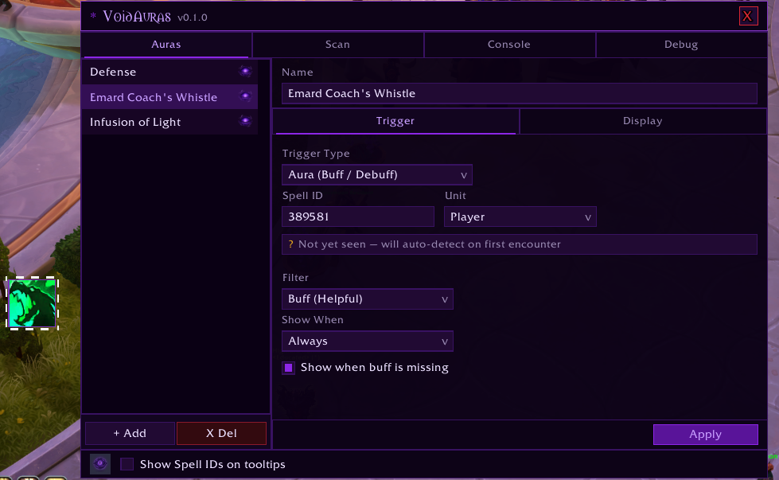

# VoidAuras [Beta]

#### _Note: This project is on hold until Blizzard updates personal auras to be accessable in combat._

A lightweight aura tracker built within the new PrivateAura constraints enforced by Blizzard. VoidAuras monitors your buffs and debuffs, and displays them as icons, progress bars, or text overlays.

## Features

- Track buffs, debuffs, and private auras (WoW 12.x compatible)
- Three display types: **Icon**, **Bar**, and **Text**
- In-game config panel via `/va`

## Usage

- `/va` — open the configuration panel

## Notes

- Requires WoW 12.x. Classic and older retail builds are not supported.
- This addon is currently in beta and is actively being developed.
